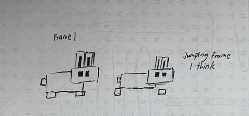

# Entry 4
##### 03/15/2026

### Continue with Learning the Desktop Pet
I continued with the [YouTube tutorial](https://www.youtube.com/watch?v=9JHFrnt5j_k) for the transparent windwos. I started off with putting a sprite as a placeholder in my testing project.

I later created the animation frames by putting two different sprite frames together to make it look like a walking animation. I added a script for the desktop pet and wrote a few lines of code in there in order for the transparent background to work.
```java
unc _ready() -> void:

	var window = get_window()

get_viewport().transparent_bg = true
window.transparent = true


window.borderless = true
window.always_on_top = true

window.unresizable = false
```
There is a problem. There were lines of red at the code. This indicated that there is an error. I was pretty confused about this. So, I decided to plan to rewatch the video tutorial and see if there is anything that I have missed. I also started to look into the next video of the [YouTube tutorial](https://www.youtube.com/watch?v=fwh0U3vIA3s&t=1s) on how I can make the movement so I can get a heads up after I finished fixing on the problem with transparent windows.

In addition, I started with the design for the desktop pet for the mvp. I decided that it would be a pixel color. I made a small sketch on what it is going to be.

My next plan is to start up on my MVP. I plan to continue with the desgin of the desktop pet. Later on, I will start with making transparent windows for the actual project while also following the video tutorial on transparent videos to see I don't miss anything. After all that, I will learn the code for the movement of the desktop pet and incorporate it into my project.

### EDP
I am still on the **planning the prototype** stage as I have learned the full process of creating transparent windows with a few errors. However, I am planning on going to making the actual prototype. I plan for the process to be a mix of _planning and making the prototype_.

### Skills
One of the skills I have developed was **How to learn**. I learned from a [YouTube tutorial](https://www.youtube.com/watch?v=fwh0U3vIA3s&t=1s) on how to create transparent window for the desktop pet. Another skill that I have learned is **embracing failure**. I had all types of errors on the code of the script. However, I choose to accept it and thinking that maybe there is something I had missed in the tutorial instead of sulking and angrily dwelling on it.

### Summary
I have learned how to put on transparent winddows for the desktop pet. However, the code in the script I created for the desktop pet had red bars all over which indicated that all of the code are errors. Instead of sulking, I calmly thought that maybe there is something I had missed in my code. My next steps are to look back at the YouTube tutorial to see what I have missed. I also plan to start a design for the desktop pet and incorporate movement in the pet from the next video of the tutorial series.

[Previous](entry03.md) | [Next](entry05.md)

[Home](../README.md)
