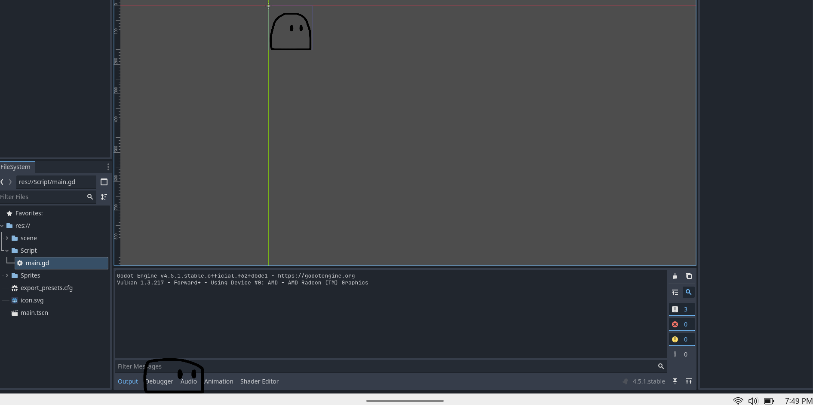

# Entry 5
##### 04/19/2026

### Creating my Desktop Pet
So, I had started and finished with creating my desktop pet. I first make the desktop pet move across the computer screen and make it flip when it reaches the end. I used a [YouTube tutorial](https://www.youtube.com/watch?v=fwh0U3vIA3s) when I was learning on how to do it.
```java
func _process(delta):
	var window = get_window()

	# Vector2 vc Vector2i
	# Monitor is grid of pixles and cannot be at 10.5
	# Can use Vector2i to tell window to move exam coordinate
	var move_vector = Vector2i(direction * move_speed)

	# Apply to window
	window.position += move_vector
```
I later gave it a brain by learning and writing the code to flip the desktop pet around when it reaches the end of the computer screen

```java
var usable_rect = DisplayServer.screen_get_usable_rect()

# Check Right Edge
# If right of window > right side of screen
if window.position.x + window.size.x > usable_rect.end.x:
		direction.x = -1
		$AnimatedSprite2D.flip_h = true

# check Left edge
# If left side of window
elif window.position.x < usable_rect.position.x:
		direction.x = 1
		$AnimatedSprite2D.flip_h = false
```
I later gave it a brain by flipping the desktop pet over when it reaches the end of the screen.
```java
var usable_rect = DisplayServer.screen_get_usable_rect()

# Check Right Edge
# If right of window > right side of screen
if window.position.x + window.size.x > usable_rect.end.x:
		direction.x = -1
		$AnimatedSprite2D.flip_h = true

# check Left edge
# If left side of window
elif window.position.x < usable_rect.position.x:
		direction.x = 1
		$AnimatedSprite2D.flip_h = false
```
Then, I started creating the code to make the desktop pet stop when I click on it. I had used this [YouTube tutorial](https://www.youtube.com/watch?v=NZgeOgFqrVU) to learned it and I incorporated it onto my own project.
```java
func _input(event):
	# check fro left pause button press
	if event is InputEventMouseButton and event.button_index == MOUSE_BUTTON_LEFT and event.pressed:
		if not is_chilling:
			start_chilling()

func start_chilling():
is_chilling = true
$AnimatedSprite2D.play("idle")

# We could add a time node connect signals, etc.
# or can use 'await'. It creates time waits, then destroys
await get_tree().create_timer(3.0).timeout

# times up
is_chilling = false
$AnimatedSprite2D.play("roll")
```
For this code, I created a function for if the desktop pet is clicked, the function `start_chilling` plays. And in that function, the desktop pet will be on the idle animation frame for about three seconds and then start resume moving. Once I finished these parts of the code, my desktop pet started to move around. This is the [link](https://github.com/xinyangl5722/apcsa-freedom-project/blob/main/main.gd) to the entire code for more understanding.

When I started testing it out, my mvp (minimal viable product) worked. My desktop pet was moving, flipping at the end of the screen, and stopped when I clicked on it.


The next step I would need to take is how I can add more to my desktop pet like creating dialogue, dragging the pet, etc. and also figure out how to publish my mvp so it goes public.

### EDP
So far, I am at the _creatiing the prototype_ and _testing and evaluating the prototype_ and had just finished that stage. I started creating the code for my desktop pet such as walking, stopping when clicked, and flipping when it reached the end of the screen, and I even gave the desktop pet a simple blob design.

### Skills
One skill I had learned was **debugging**. When I finished my code, I realized that when my desktop pet flipped, it disappeared. So, I backtracked on my code. I got up to the code line where it says `$AnimatedSprite2D.frame_changed.connect(_update_mouse_mask)` and realized that was the reason why the desktop pet disappeared. So, I commented that out and it started to work again. Another skill I had developed was **how to learn**. I used the YouTube video series to guide me on how to move the desktop pet, flip it around when reached the end of the computer screen, and make it stop when I clicked on it.

### Summary
So far, I have finished my mvp (minimum viable product). I learned how to make the desktop pet move and stop on command. I had an error while making the desktop pet interactive on the process but I decided to backtrack on my code a little bit to see what line of code caused this and eventually solved the problem. My next step on my project is to make the desktop pet a little more interactive while giving it an improved design while also figuring out how to export it so it can be previewed to the public.

[Previous](entry04.md) | [Next](entry06.md)

[Home](../README.md)
